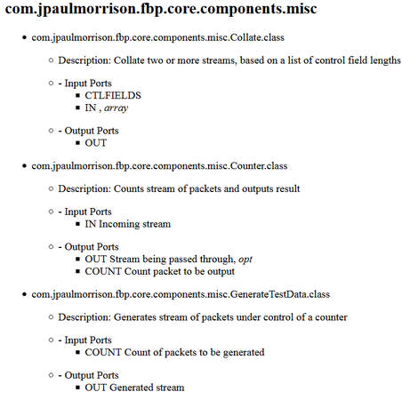

# javafbp-compattrs

Function to build FBP-oriented Javadoc for FBP components

## Building/viewing Component Attributes List

This function will build Javadoc-style listing of FBP attributes for selected components.
 
You can display the current JavaFBP components list by clicking on http://htmlpreview.github.io/?https://github.com/jpaulm/javafbp/blob/master/compList.html then `Edit/Find in This Page` (unfortunately you cannot click on the `compList.html` file directly on GitHub).  

Here is a portion of `compList`:

To rebuild it, execute the `.bat` file `javafbpcompattrs.bat` in your JavaFBP root directory.  The result will be in `<user>/temp/JavaFBPCompAttrs.html`.

